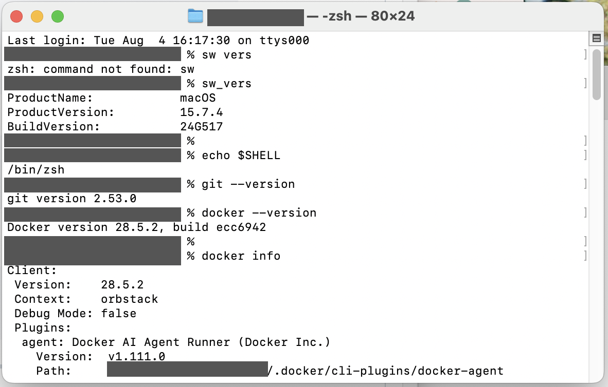
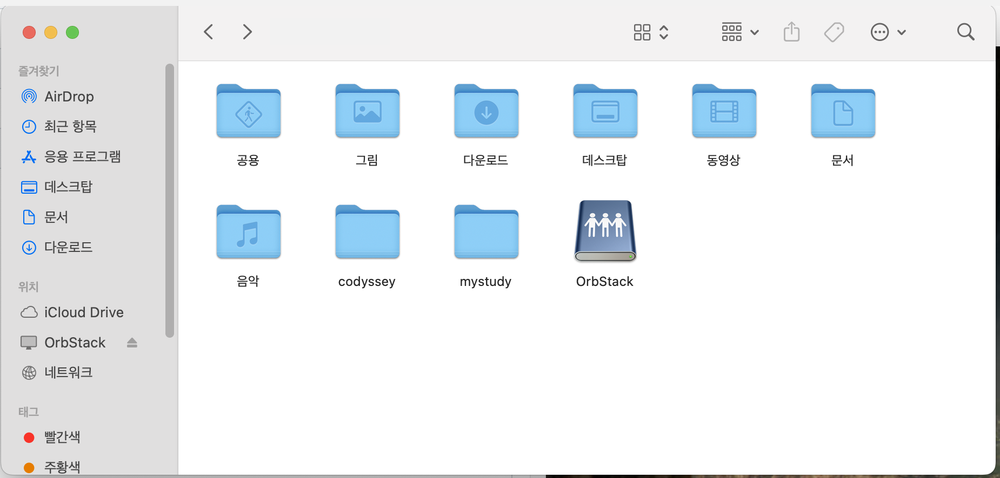
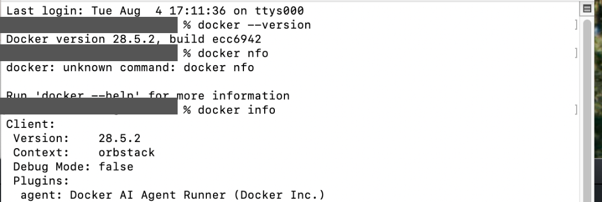
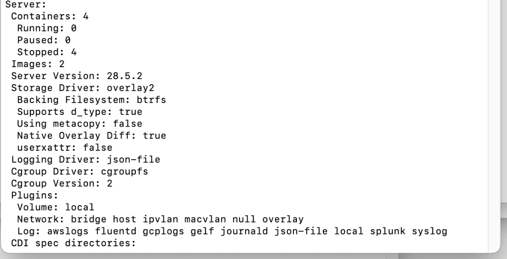
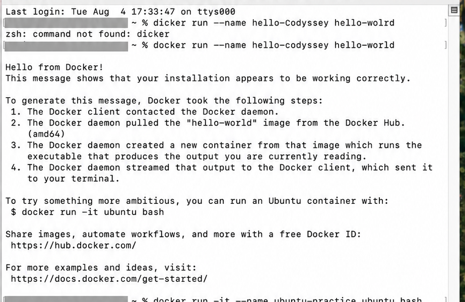
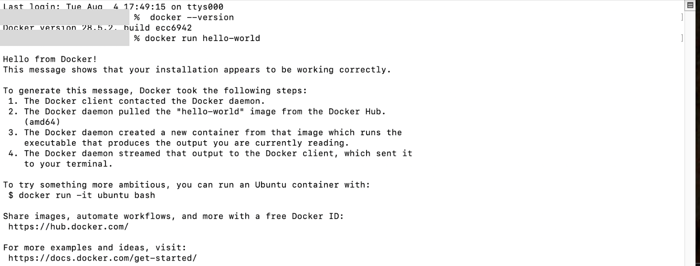
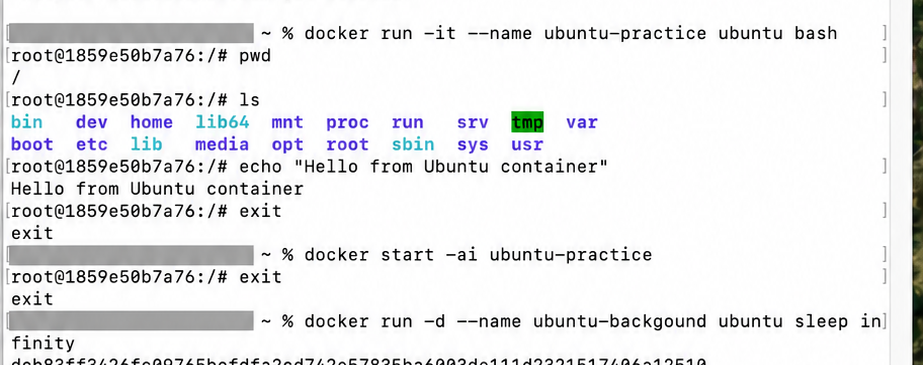
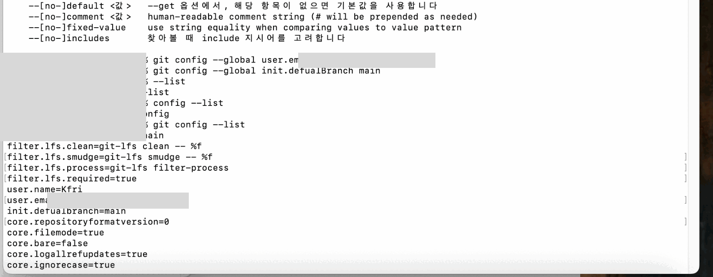
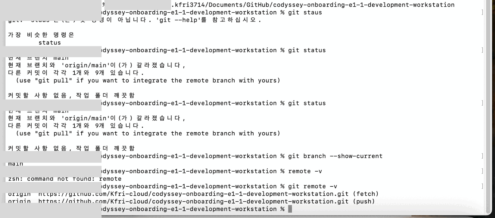
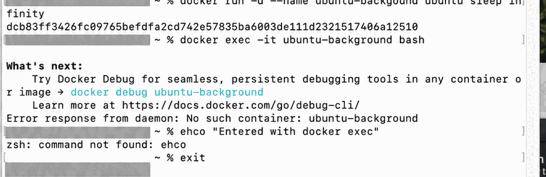

# Codyssey E1-1 개발 워크스테이션 구축

## 1. 프로젝트 개요

이 프로젝트는 개발 워크스테이션을 직접 구성하면서 Linux CLI, Docker, Git/GitHub의 기본 흐름을 실습한 결과물이다.

터미널에서 파일과 디렉터리를 관리하고, macOS에서 OrbStack을 이용해 Docker 컨테이너를 실행했다. `hello-world`, Ubuntu, Nginx, MySQL 컨테이너를 직접 생성하고 이미지·컨테이너 조회, 로그 확인, 포트 매핑, 컨테이너 내부 접근, 삭제, 바인드 마운트에 따른 데이터 유지 여부를 검증했다.

### 미션 목표

- CLI로 파일과 디렉터리를 생성·복사·이동·삭제한다.
- 절대 경로와 상대 경로의 차이를 설명한다.
- 파일과 디렉터리 권한의 의미를 설명한다.
- Docker 이미지와 컨테이너의 차이를 설명한다.
- 컨테이너를 생성·실행·중지·삭제한다.
- 포트 매핑으로 컨테이너의 웹 서버에 접속한다.
- 바인드 마운트와 Docker 볼륨의 차이를 설명한다.
- Git과 GitHub를 이용해 실습 결과를 기록하고 공유한다.

---

## 2. 실행 환경

| 항목 | 환경 |
|---|---|
| Host OS | macOS 15.7.4 (Build 24G517) |
| Shell | zsh (`/bin/zsh`) |
| Terminal | macOS Terminal |
| Editor | Visual Studio Code |
| Docker 실행 환경 | OrbStack (`orbstack` context) |
| Docker Client | 28.5.2 (build ecc6942) |
| Git | 2.53.0 |
| 기본 브랜치 | `main` |

```bash
sw_vers
echo $SHELL
git --version
docker --version
docker info
```



처음에는 `sw vers`와 `doker info`처럼 명령을 잘못 입력해 오류가 발생했다. 각각 `sw_vers`, `docker info`로 수정해 정상적으로 실행했다.

- [Docker 환경 확인 로그](./docs/logs/docker/info.txt)

---

## 3. 프로젝트 구조

```text
E1-1/
├── README.md
└── docs/
    ├── images/
    │   ├── 01-environment.png
    │   ├── 02-directory-created.png
    │   ├── 03-file-copy-rename.png
    │   ├── 04-file-delete.png
    │   ├── 05-directory-delete.png
    │   ├── 06-docker-client.png
    │   ├── 07-docker-server.png
    │   ├── 08-hello-world.png
    │   ├── 09-ubuntu-practice.png
    │   ├── 10-background-name-error.png
    │   ├── 11-docker-hello-world-masked.png
    │   ├── 11-git-config.png
    │   └── 12-github-remote.png
    └── logs/
        └── docker/
            ├── info.txt
            ├── hellow-world
            ├── Ubuntu_1.txt
            ├── Ubuntu_2.txt
            └── docker_practice/
                ├── docker_container_create_del.txt
                ├── docker_exec -it
                ├── docker_image.txt
                ├── docker_logs
                ├── docker_mapping
                ├── docker_nginx.txt
                ├── docker_volume
                └── docker_volume_Non
```

---

## 4. 수행 체크리스트

- [x] 저장소 및 프로젝트 디렉터리 구성
- [x] OS, Shell, Docker, Git 환경 확인
- [x] 터미널 기본 명령 실습
- [x] 절대 경로와 상대 경로 확인
- [ ] 파일 및 디렉터리 권한 변경 결과 기록
- [x] Docker Client 동작 확인
- [x] `hello-world` 컨테이너 실행
- [x] Ubuntu 컨테이너 실행 및 내부 명령 수행
- [x] 이미지·컨테이너 목록 확인 및 정리
- [x] Nginx 컨테이너 실행 및 내부 설정 확인
- [x] 포트 매핑 적용
- [x] MySQL 바인드 마운트 데이터 유지 확인
- [ ] Dockerfile 기반 커스텀 이미지 빌드
- [ ] Docker가 관리하는 이름 있는 볼륨 영속성 확인
- [x] Git 설정 및 GitHub 원격 저장소 확인

---

## 5. 터미널 기본 조작

### 5.1 수행 명령

```bash
pwd
mkdir -p ~/codyssey/practice
cd ~/codyssey/practice
ls -la

touch original.txt
echo "Codyssey CLI practice" > original.txt
cat original.txt

cp original.txt coide.txt
mv coide.txt renamed.txt
mkdir sample-directory

rm renamed.txt
rmdir sample-directory
ls -la
```

### 5.2 검증 결과

- `pwd`로 현재 위치를 확인했다.
- `mkdir -p`로 중간 경로를 포함한 실습 디렉터리를 생성했다.
- `touch`와 `echo`로 파일을 생성하고 내용을 기록했다.
- `cp`로 파일을 복사하고 `mv`로 이름을 변경했다.
- `rm`으로 파일을, `rmdir`로 빈 디렉터리를 삭제했다.
- 명령 옵션과 경로 사이에 공백이 필요하다는 것을 오류를 통해 확인했다.

### 5.3 실습 이미지

디렉터리 생성:



파일 복사 및 이름 변경:


파일 삭제:


빈 디렉터리 삭제:


### 5.4 절대 경로와 상대 경로

- **절대 경로**: 파일 시스템의 최상위 위치부터 작성한 전체 경로
- **상대 경로**: 현재 작업 디렉터리를 기준으로 작성한 경로

```text
절대 경로: /Users/[사용자명]/codyssey/practice/original.txt
상대 경로: ./original.txt
```

---

## 6. 파일 및 디렉터리 권한

| 권한 | 파일에서의 의미 | 디렉터리에서의 의미 | 숫자 |
|---|---|---|---:|
| `r` | 내용 읽기 | 목록 확인 | 4 |
| `w` | 내용 수정 | 파일 생성·삭제 | 2 |
| `x` | 파일 실행 | 디렉터리 내부 접근 | 1 |

권한은 소유자(User), 그룹(Group), 기타 사용자(Others) 순서로 표시된다.

```text
644 = rw-r--r--
755 = rwxr-xr-x
600 = rw-------
700 = rwx------
```

디렉터리의 `x`는 프로그램 실행이 아니라 디렉터리 내부에 접근할 수 있는 권한이다.

현재 저장소에는 권한 변경 결과 로그가 없으므로, 다음 실습 후 실제 출력 결과를 추가해야 한다.

```bash
chmod 700 permission-practice/my-directory
chmod 600 permission-practice/my-file.txt
ls -ld permission-practice/my-file.txt permission-practice/my-directory

chmod 755 permission-practice/my-directory
chmod 644 permission-practice/my-file.txt
ls -ld permission-practice/my-file.txt permission-practice/my-directory
```

---

## 7. Docker 설치 및 기본 점검

### 7.1 Client와 Server

- **Docker Client**는 사용자가 입력한 `docker` 명령을 Docker 엔진에 전달한다.
- **Docker Server(Daemon)**는 이미지 다운로드, 컨테이너 생성 및 실행을 실제로 처리한다.
- `docker info`에서 Client와 Server 정보가 모두 출력되면 Docker 엔진이 실행 중인 상태다.





### 7.2 이미지와 컨테이너

| 구분 | 이미지 | 컨테이너 |
|---|---|---|
| 의미 | 실행 환경을 만드는 읽기 전용 설계도 | 이미지를 기반으로 실제 실행된 환경 |
| 상태 | 실행되지 않음 | 실행·중지·삭제 가능 |
| 관계 | 하나의 이미지로 여러 컨테이너 생성 가능 | 생성할 때 특정 이미지를 사용 |

```text
Image → Container 생성 → 실행 → 중지 → 삭제
```

---

## 8. hello-world 실행

```bash
docker run --name hello-test hello-world
docker images
docker ps
docker ps -a --filter name=hello-test
```

`Hello from Docker!` 메시지와 `Exited (0)` 상태를 통해 컨테이너가 오류 없이 작업을 마치고 종료된 것을 확인했다.

- `docker ps`: 현재 실행 중인 컨테이너만 표시
- `docker ps -a`: 종료된 컨테이너를 포함해 모두 표시
- `Exited (0)`: 명령을 정상적으로 끝내고 종료됨





- [hello-world 전체 로그](./docs/logs/docker/hellow-world)

---

## 9. Ubuntu 컨테이너 실습

### 9.1 백그라운드 실행

```bash
docker run -dit --name ubuntu-practice00 ubuntu:24.04 bash
docker ps --filter name=ubuntu-practice00
docker exec ubuntu-practice00 pwd
docker exec ubuntu-practice00 ls -la /
docker exec ubuntu-practice00 cat /etc/os-release
```

Ubuntu 24.04.4 LTS 컨테이너가 백그라운드에서 실행됐으며, 컨테이너 내부의 시작 위치가 `/`임을 확인했다.



- [Ubuntu 실행 및 내부 확인 로그](./docs/logs/docker/Ubuntu_1.txt)
- [Ubuntu 추가 실습 로그](./docs/logs/docker/Ubuntu_2.txt)

### 9.2 컨테이너 내부 파일 생성

```bash
docker exec ubuntu-practice00 sh -c \
  'echo "Hello from Ubuntu container" > /tmp/hello.txt'
docker exec ubuntu-practice00 cat /tmp/hello.txt
```

`sh -c`를 사용하는 이유는 출력 리다이렉션 `>`까지 컨테이너 내부의 Shell에서 해석하도록 만들기 위해서다.

### 9.3 오류 확인

```text
exec: "ls-la": executable file not found in $PATH
```

`ls-la`는 하나의 명령으로 해석되지만 그런 실행 파일은 존재하지 않는다. `ls -la`처럼 명령과 옵션 사이에 공백을 넣어 해결했다.

---

## 10. 컨테이너 생성·실행·중지·삭제

```bash
docker create nginx
docker ps -a
docker start <컨테이너_ID>
docker stop <컨테이너_ID>
docker rm <컨테이너_ID>
docker rm -f <실행_중인_컨테이너_ID>
```

- `docker create`: 컨테이너만 생성하고 실행하지 않는다.
- `docker start`: 생성 또는 중지된 컨테이너를 실행한다.
- `docker stop`: 실행 중인 컨테이너를 정상 중지한다.
- `docker rm`: 중지된 컨테이너를 삭제한다.
- `docker rm -f`: 실행 중인 컨테이너를 강제로 중지하고 삭제한다.

실행 중인 컨테이너를 일반 `docker rm`으로 삭제하려 하자 오류가 발생했고, `docker rm -f`로 정리했다.

- [컨테이너 생성·삭제 전체 로그](./docs/logs/docker/docker_practice/docker_container_create_del.txt)

---

## 11. 이미지 관리

```bash
docker pull nginx:alpine
docker image ls
docker image rm <이미지_ID>
```

Nginx의 `latest`와 `alpine` 이미지를 비교했을 때 실습 당시 크기는 각각 약 161MB와 62.4MB였다. Alpine 기반 이미지는 더 작은 Linux 배포판을 사용하므로 상대적으로 용량이 작다.

> `docker images ls`가 아니라 `docker images` 또는 `docker image ls`를 사용해야 한다.

- [이미지 다운로드·조회·삭제 로그](./docs/logs/docker/docker_practice/docker_image.txt)

---

## 12. Nginx 컨테이너와 내부 접근

```bash
docker run -d nginx
docker ps
docker exec -it <컨테이너_ID> bash
cd /etc/nginx
ls
cat nginx.conf
```

`docker exec -it`로 실행 중인 컨테이너에 새로운 대화형 Bash 프로세스를 실행했다. `/etc/nginx/nginx.conf`를 읽어 Nginx 설정 구조를 확인했다.

처음에는 `cat nginx,conf`처럼 쉼표를 입력해 파일을 찾을 수 없었고, 정확한 파일명인 `nginx.conf`로 수정했다.

- [Nginx 내부 접근 로그](./docs/logs/docker/docker_practice/docker_exec%20-it)
- [Nginx 실행 로그](./docs/logs/docker/docker_practice/docker_nginx.txt)

---

## 13. Docker 로그 확인

```bash
docker logs <컨테이너_ID>
docker logs --tail 10 <컨테이너_ID>
docker logs -f <컨테이너_ID>
docker logs --tail 0 -f <컨테이너_ID>
```

| 명령 | 의미 |
|---|---|
| `docker logs` | 지금까지 출력된 로그 전체 확인 |
| `--tail 10` | 마지막 10줄만 확인 |
| `-f` | 새 로그를 실시간으로 계속 확인 |
| `--tail 0 -f` | 기존 로그를 제외하고 새 로그부터 확인 |

- [Docker 로그 확인 실습](./docs/logs/docker/docker_practice/docker_logs)

---

## 14. 포트 매핑

```bash
docker run -d -p 4000:80 nginx
docker ps
```

`-p 4000:80`은 호스트의 4000번 포트를 컨테이너의 80번 포트에 연결한다.

```text
브라우저 또는 호스트 :4000 → 컨테이너 Nginx :80
```

컨테이너는 독립된 네트워크 환경에서 실행되므로 호스트에서 접근하려면 포트 연결이 필요하다.

- [포트 매핑 확인 로그](./docs/logs/docker/docker_practice/docker_mapping)

---

## 15. MySQL 데이터 유지 실습

### 15.1 마운트하지 않은 경우

MySQL 컨테이너 안에서 `mydb` 데이터베이스를 생성한 뒤 컨테이너를 삭제하고 새 컨테이너를 만들었다.

```sql
CREATE DATABASE mydb;
SHOW DATABASES;
```

새 컨테이너에서는 `mydb`가 보이지 않았다. 별도의 저장 공간을 연결하지 않으면 데이터가 컨테이너의 쓰기 계층에 저장되므로 컨테이너 삭제와 함께 사라진다.

- [마운트하지 않은 MySQL 실습](./docs/logs/docker/docker_practice/docker_volume_Non)

### 15.2 바인드 마운트를 사용한 경우

```bash
docker run \
  --name mysql-practice \
  -e MYSQL_ROOT_PASSWORD='[비밀번호]' \
  -d \
  -p 3306:3306 \
  -v "$HOME/downloads/docker:/var/lib/mysql" \
  mysql
```

호스트의 `$HOME/downloads/docker` 폴더와 컨테이너의 `/var/lib/mysql`을 연결했다. 컨테이너를 다시 생성한 뒤에도 `mydb`가 남아 있어 데이터 유지를 확인했다.

- [바인드 마운트 MySQL 실습](./docs/logs/docker/docker_practice/docker_volume)

> 이 명령의 `-v` 왼쪽 값은 호스트 경로이므로 **바인드 마운트**다. Docker가 관리하는 이름 있는 볼륨을 사용하려면 `-v codyssey-data:/var/lib/mysql`처럼 왼쪽에 볼륨 이름을 작성해야 한다.

---

## 16. 바인드 마운트와 Docker 볼륨 비교

| 구분 | 바인드 마운트 | Docker 볼륨 |
|---|---|---|
| 왼쪽 값 예시 | `$HOME/downloads/docker` | `codyssey-data` |
| 저장 위치 | 사용자가 지정한 호스트 경로 | Docker가 관리하는 영역 |
| 경로 의존성 | 호스트 경로에 의존 | 상대적으로 낮음 |
| 주요 용도 | 개발 소스·설정 파일 연결 | 데이터베이스·서비스 데이터 보존 |

현재 완료한 MySQL 실습은 바인드 마운트이다. 이름 있는 Docker 볼륨 실습은 다음 명령으로 추가 검증할 수 있다.

```bash
docker volume create codyssey-data

docker run -d \
  --name mysql-volume-test \
  -e MYSQL_ROOT_PASSWORD='[비밀번호]' \
  -v codyssey-data:/var/lib/mysql \
  mysql

docker volume ls
docker volume inspect codyssey-data
```

---

## 17. Git과 GitHub 연동

### 17.1 역할 차이

- **Git**: 내 컴퓨터에서 파일 변경 이력과 커밋을 관리하는 도구
- **GitHub**: Git 저장소를 온라인에 보관하고 공유·협업하는 서비스

```bash
git --version
git config --global --get user.name
git config --global --get user.email
git config --global --get init.defaultBranch
git branch --show-current
git remote -v
```

기본 브랜치가 `main`이고 원격 저장소가 `Kfri-cloud/Codyssey`를 가리키는 것을 확인했다. 공개 문서에서는 이메일 주소를 마스킹했다.





---

## 18. 트러블슈팅

### 18.1 명령과 옵션 사이의 공백 누락

**문제**

```text
exec: "ls-la": executable file not found in $PATH
```

**원인**

`ls-la`를 하나의 실행 파일 이름으로 해석했지만 해당 파일이 존재하지 않았다.

**확인 및 해결**

```bash
docker exec ubuntu-practice00 ls -la /
```

`ls`와 `-la` 사이에 공백을 넣어 정상적으로 파일 목록을 확인했다.



### 18.2 MySQL 명령 실행 위치 오류

**문제**

컨테이너의 Bash에서 바로 `show databases;`를 입력하자 다음 오류가 발생했다.

```text
bash: show: command not found
```

**원인**

`SHOW DATABASES;`는 Bash 명령이 아니라 MySQL 클라이언트 안에서 사용하는 SQL 문이다.

**해결**

```bash
mysql -u root -p
```

MySQL에 접속한 뒤 `SHOW DATABASES;`를 실행해 정상적으로 데이터베이스 목록을 확인했다.

### 18.3 실행 중인 컨테이너 삭제 오류

**문제**

```text
container is running: stop the container before removing or force remove
```

**원인**

`docker rm`은 기본적으로 실행 중인 컨테이너를 삭제하지 않는다.

**해결**

```bash
docker stop <컨테이너_ID>
docker rm <컨테이너_ID>
```

또는 실습 컨테이너임을 확인한 뒤 다음 명령으로 강제 정리했다.

```bash
docker rm -f <컨테이너_ID>
```

---

## 19. 보안 및 개인정보 보호

- GitHub에는 실제 비밀번호, 토큰, 개인키, 인증 코드를 올리지 않는다.
- README의 MySQL 비밀번호는 `[비밀번호]`로 마스킹한다.
- 터미널 캡처에서는 사용자명과 이메일을 가린다.
- `.DS_Store`는 프로젝트 파일이 아니므로 `.gitignore`에 추가한다.
- 이미 공개 저장소에 실제 비밀번호를 올렸다면 파일만 수정하지 말고 해당 비밀번호도 변경한다.

권장 `.gitignore`:

```gitignore
.DS_Store
.env
*.pem
*.key
```

---

## 20. 결과 요약

이번 실습을 통해 터미널 기본 조작, Docker Client와 Server의 관계, 이미지와 컨테이너의 차이, 컨테이너의 생성·실행·중지·삭제 흐름을 확인했다.

또한 Nginx 컨테이너 내부에 접속해 설정 파일을 살펴보고, 로그 확인과 포트 매핑을 실습했다. MySQL 실습에서는 저장 공간을 연결하지 않으면 컨테이너 삭제 시 데이터가 사라지고, 호스트 디렉터리를 바인드 마운트하면 새 컨테이너에서도 데이터가 유지되는 차이를 확인했다.

현재 실제 증거가 남아 있는 항목은 완료로 표시했으며, Dockerfile을 이용한 커스텀 이미지 빌드, 이름 있는 Docker 볼륨, 파일 권한 변경 결과는 추가 실습 후 보완해야 한다.
