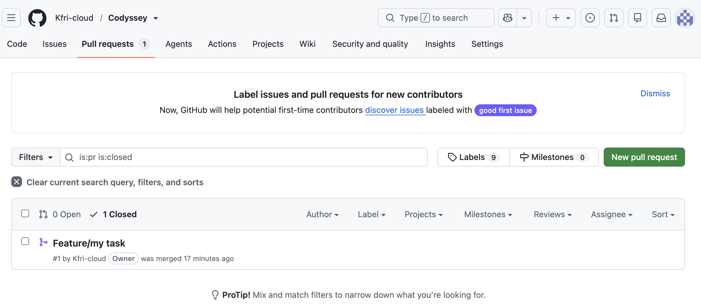

# E1-2 | Python & Git Basic

## 컴퓨터에게 명령 내리는 말(파이썬) 처음 배우기

> Python 기본 문법, 객체지향 프로그래밍, JSON 파일 입출력과 Git을 활용하여  
> **터미널에서 실행되는 별자리 퀴즈 게임**을 구현한 프로젝트입니다.

---

## 1. 프로젝트 개요

이번 프로젝트의 목표는 Python 문법을 단순히 학습하는 것을 넘어 직접 동작하는 프로그램을 처음부터 끝까지 구현하는 것입니다.

터미널에서 실행되는 **별자리 퀴즈 게임**을 제작하면서 다음 내용을 학습했습니다.

- Python 기본 문법
- 변수와 자료형
- 조건문과 반복문
- 함수와 메서드
- 클래스와 객체
- 사용자 입력 및 예외 처리
- JSON 파일 저장/불러오기
- 데이터 영속성
- Git 버전 관리
- Branch 생성 및 Merge
- Clone / Pull을 이용한 원격 저장소 동기화

프로그램에서는 다음 기능을 제공합니다.

```text
=== 별자리 퀴즈 게임 ===

1. 퀴즈 풀기
2. 퀴즈 추가
3. 퀴즈 목록 보기
4. 최고 점수 확인
5. 종료
```

---

## 2. 퀴즈 주제 선정 이유

### 주제: 별자리

퀴즈의 주제는 **별자리**로 선정했습니다.

별자리는 사자자리, 쌍둥이자리, 물고기자리처럼 이름이 명확하고 영어 이름이나 특징을 활용하여 객관식 문제를 만들기 쉽습니다.

또한 다양한 별자리 정보를 문제 데이터로 확장할 수 있기 때문에 퀴즈 프로그램의 구조를 연습하기에 적합하다고 판단했습니다.

기본 데이터에는 5개 이상의 별자리 문제가 포함되어 있습니다.

```text
사자자리의 영어 이름은 무엇일까요?

1. Leo
2. Gemini
3. Pisces
4. Aries
```

---

## 3. 주요 기능

| 기능 | 설명 |
|---|---|
| 퀴즈 풀기 | 저장된 별자리 퀴즈를 순서대로 풉니다. |
| 정답 판정 | 사용자가 선택한 번호와 정답을 비교합니다. |
| 퀴즈 추가 | 새로운 문제와 선택지 4개를 등록합니다. |
| 퀴즈 목록 | 현재 저장되어 있는 문제를 확인합니다. |
| 최고 점수 | 지금까지 기록된 최고 점수를 확인합니다. |
| JSON 저장 | 퀴즈와 최고 점수를 `state.json`에 저장합니다. |
| 데이터 복구 | 저장 파일이 없거나 손상된 경우 기본 퀴즈를 사용합니다. |
| 입력 검증 | 빈 값, 문자 입력, 범위를 벗어난 숫자를 처리합니다. |
| 안전한 종료 | `Ctrl+C`, `EOF` 발생 시 가능한 데이터를 저장하고 종료합니다. |

---

## 4. 실행 방법

### 실행 환경

- Python 3.10 이상
- 외부 라이브러리 사용 없음
- Python 표준 라이브러리 사용

### 저장소 Clone

```bash
git clone https://github.com/Kfri-cloud/Codyssey.git
cd Codyssey/E1-2/Star_QuizGmae
python3 practice_skeleton.py
```

환경에 따라 `python practice_skeleton.py`를 사용할 수도 있습니다.

---

## 5. 프로그램 구조

현재 구현의 핵심 코드는 `practice_skeleton.py`에 있으며 세 개의 클래스가 역할을 나누어 담당합니다.

```text
practice_skeleton.py

├── Quiz
│   ├── 문제 데이터 관리
│   ├── 선택지 출력
│   └── 정답 판정
│
├── QuizGame
│   ├── 메뉴
│   ├── 퀴즈 진행
│   ├── 퀴즈 추가
│   ├── 퀴즈 목록
│   ├── 최고 점수
│   └── 입력 처리
│
└── Storage
    ├── state.json 읽기
    ├── state.json 쓰기
    ├── 데이터 검증
    └── 기본 퀴즈 복구
```

<details>
<summary><strong>Quiz 클래스 역할 자세히 보기</strong></summary>

### Quiz

`Quiz`는 **퀴즈 한 문제**를 표현합니다.

| 속성 | 역할 |
|---|---|
| `question` | 문제 내용 |
| `choices` | 선택지 목록 |
| `answer` | 정답 번호 |

주요 메서드는 `display()`, `is_correct()`, `to_dict()`, `from_dict()`입니다.

- `display()` : 문제와 선택지 4개를 출력합니다.
- `is_correct()` : 사용자가 선택한 번호와 실제 정답을 비교합니다.
- `to_dict()` : `Quiz` 객체를 JSON으로 저장 가능한 `dict`로 변환합니다.
- `from_dict()` : JSON에서 읽은 데이터를 검증하여 `Quiz` 객체로 변환합니다.

```text
Quiz 객체 → to_dict() → JSON 저장
JSON 데이터 → from_dict() → Quiz 객체
```

</details>

<details>
<summary><strong>QuizGame 클래스 역할 자세히 보기</strong></summary>

### QuizGame

`QuizGame`은 **게임 전체의 흐름과 사용자 상호작용**을 담당합니다.

주요 기능은 다음과 같습니다.

- 메뉴 출력
- 사용자 입력
- 퀴즈 진행
- 점수 계산
- 퀴즈 추가
- 퀴즈 목록 출력
- 최고 점수 확인
- Storage에 저장 요청

`Quiz`가 문제 하나를 담당한다면 `QuizGame`은 여러 문제를 이용한 게임 전체 진행을 담당합니다.

</details>

<details>
<summary><strong>Storage 클래스 역할 자세히 보기</strong></summary>

### Storage

`Storage`는 게임 로직과 파일 저장 로직을 분리하기 위해 사용했습니다.

- `load()` : `state.json`을 읽어 퀴즈와 최고 점수를 가져옵니다.
- `save()` : 현재 퀴즈 목록과 최고 점수를 JSON 파일에 저장합니다.
- `create_default_quizzes()` : 저장 파일이 없거나 손상되었을 때 사용할 기본 퀴즈를 생성합니다.

따라서 게임 진행 코드가 직접 JSON 파일을 처리하지 않고 `Storage`가 파일 관련 책임을 담당합니다.

</details>

---

## 6. 클래스와 함수를 분리한 이유

프로그램의 모든 기능을 하나의 함수 안에 작성하면 코드가 길어지고 기능 간 의존성이 커집니다.

```text
Quiz     → 문제 하나에 대한 책임
QuizGame → 게임 전체 진행에 대한 책임
Storage  → 파일 저장과 불러오기에 대한 책임
```

역할별로 책임을 분리하면 특정 기능을 수정할 때 다른 코드에 미치는 영향을 줄일 수 있고 코드의 역할을 이해하기 쉬워집니다.

---

## 7. 입력 처리

사용자가 항상 올바른 값을 입력한다고 가정할 수 없기 때문에 공통 입력 검증 로직을 구현했습니다.

```text
사용자 입력
    ↓
strip()
    ↓
빈 값 확인
    ↓
int() 변환
    ↓
범위 확인
    ↓
정상 값 반환
```

<details>
<summary><strong>입력 오류 처리 기준 보기</strong></summary>

### 앞뒤 공백

`" 1 "`처럼 입력해도 `strip()`을 사용하여 `"1"`로 처리합니다.

### 빈 입력

아무 값도 입력하지 않으면 안내 메시지를 출력한 후 다시 입력받습니다.

### 문자 입력

숫자가 필요한 곳에 `abc`와 같은 값을 입력하면 `int()` 변환 과정에서 발생하는 `ValueError`를 처리하고 다시 입력받습니다.

### 범위를 벗어난 숫자

메뉴에서 `9`, 정답에서 `0`과 같이 허용 범위를 벗어난 숫자를 입력하면 범위를 안내하고 다시 입력받습니다.

</details>

---

## 8. 예외 처리

프로그램이 예상하지 못한 입력이나 파일 오류 때문에 바로 종료되지 않도록 `try / except`를 사용했습니다.

| 예외 | 발생 상황 | 처리 |
|---|---|---|
| `ValueError` | 숫자 변환/데이터 형식 오류 | 안내 후 재입력 또는 데이터 복구 |
| `FileNotFoundError` | `state.json` 없음 | 기본 퀴즈 사용 |
| `JSONDecodeError` | JSON 파일 손상 | 기본 데이터로 복구 |
| `OSError` | 파일 읽기/쓰기 오류 | 오류 안내 |
| `KeyboardInterrupt` | `Ctrl+C` | 저장 후 안전하게 종료 |
| `EOFError` | 입력 스트림 종료 | 저장 후 안전하게 종료 |

---

## 9. JSON을 사용하는 이유

프로그램을 종료하면 메모리에 있던 변수의 값은 사라집니다. 사용자가 추가한 퀴즈와 최고 점수를 다음 실행에서도 사용할 수 있도록 데이터를 파일에 저장해야 합니다.

JSON을 선택한 이유는 다음과 같습니다.

- 사람이 직접 읽기 쉽습니다.
- Python의 `dict`, `list` 구조와 잘 대응됩니다.
- 별도의 데이터베이스 없이 간단하게 저장할 수 있습니다.
- 프로그램을 종료했다 다시 실행해도 데이터를 유지할 수 있습니다.

### state.json

저장 위치:

```text
E1-2/Star_QuizGmae/state.json
```

기본 구조:

```json
{
  "quizzes": [
    {
      "question": "사자자리의 영어 이름은 무엇일까요?",
      "choices": ["Leo", "Gemini", "Pisces", "Aries"],
      "answer": 1
    }
  ],
  "best_score": null
}
```

| 필드 | 자료형 | 설명 |
|---|---|---|
| `quizzes` | list | 전체 퀴즈 목록 |
| `question` | str | 문제 |
| `choices` | list | 4개의 선택지 |
| `answer` | int | 정답 번호 |
| `best_score` | int / null | 최고 점수 |

파일은 UTF-8로 읽고 저장하며 `ensure_ascii=False`를 사용하여 한글이 그대로 저장될 수 있도록 했습니다.

---

## 10. 데이터 저장/불러오기 흐름

```text
프로그램 시작
      ↓
state.json 확인
      ↓
정상적인 JSON 파일인가?
   ↙ Yes          ↘ No
저장 데이터         기본 퀴즈
불러오기            생성/복구
   ↘                ↙
       QuizGame 실행
            ↓
    퀴즈 추가 / 게임 진행
            ↓
       state.json 저장
            ↓
           종료
```

이 구조를 통해 프로그램을 다시 실행해도 추가한 퀴즈와 최고 점수를 유지할 수 있습니다.

---

## 11. 파일 구조

```text
E1-2/
│
├── README.md
├── Practice/
│
└── Star_QuizGmae/
    ├── practice_skeleton.py
    ├── state.json
    ├── Concept/
    │   └── Concept.md
    ├── System design/
    │   └── System design.md
    ├── Image/
    │   ├── git_log .png
    │   ├── git_병합.png
    │   └── 실행 및 검증 스크린샷
    └── source/
        ├── E1-2.pdf
        └── e1-1.png
```

---

## 12. 학습 자료

프로그램 구현뿐 아니라 구현 전에 필요한 개념과 구조를 별도의 문서로 정리했습니다.

### Python / Git 개념 정리

[Concept.md](./Star_QuizGmae/Concept/Concept.md)

- 변수와 자료형
- 조건문과 반복문
- 함수
- 클래스와 객체
- `__init__`, `self`
- JSON과 파일 입출력
- 예외 처리
- Git
- Branch / Merge

### 시스템 설계

[System design.md](./Star_QuizGmae/System%20design/System%20design.md)

- 클래스별 책임
- 입력 처리 구조
- JSON 데이터 구조
- 프로그램 실행 흐름
- 파일 오류 복구
- Git 작업 흐름

### 미션 원문

[E1-2.pdf](./Star_QuizGmae/source/E1-2.pdf)

---

## 13. Git Workflow

이번 프로젝트에서는 단순히 최종 코드만 업로드하는 것이 아니라 Git을 이용해 변경 과정을 기록했습니다.

```text
작업
 ↓
git add
 ↓
git commit
 ↓
git push
 ↓
branch 작업
 ↓
merge
 ↓
main 반영
```

<details>
<summary><strong>Branch / Merge 과정 보기</strong></summary>

기능을 별도의 브랜치에서 작업한 후 `main`으로 병합하는 과정을 실습했습니다.

```bash
git checkout -b feature/my-task
git add .
git commit -m "feat: 기능 구현"
git push
```

### 병합 증빙



브랜치를 사용하면 새로운 기능을 기존 `main` 코드와 분리하여 작업할 수 있습니다.

</details>

<details>
<summary><strong>Git Commit Graph 보기</strong></summary>

Git 변경 이력은 다음 명령어를 이용하여 확인했습니다.

```bash
git log --oneline --graph --all
```

### Git Log


커밋을 기능 단위로 구분하면 코드의 변경 과정을 추적하기 쉬워집니다.

</details>

<details>
<summary><strong>Clone / Pull 개념 보기</strong></summary>

### clone

원격 저장소 전체를 새로운 로컬 디렉터리로 복제합니다.

```bash
git clone <repository>
```

### pull

이미 존재하는 로컬 저장소에서 원격 저장소의 최신 변경사항을 가져옵니다.

```bash
git pull
```

```text
clone → 원격 저장소를 새로운 로컬 저장소로 복제
pull  → 기존 로컬 저장소를 원격 저장소의 최신 상태로 갱신
```

</details>

---

## 14. 실행 및 검증 결과

프로그램에서 다음 항목을 기준으로 동작을 검증했습니다.

- 메뉴 정상 출력
- 퀴즈 풀기
- 정답 / 오답 판정
- 퀴즈 추가
- 퀴즈 목록
- 최고 점수 확인
- 잘못된 입력 처리
- 프로그램 재실행 후 데이터 유지
- Git Branch / Merge
- Git Commit Graph

실행 결과와 Git 작업 과정은 [`Image`](./Star_QuizGmae/Image/) 디렉터리에 정리했습니다.

---

## 15. 핵심 기술 정리

<details>
<summary><strong>Class를 사용한 이유</strong></summary>

함수만으로도 프로그램을 만들 수 있지만 프로그램의 규모가 커질수록 어떤 데이터와 함수가 서로 관련되어 있는지 파악하기 어려워집니다.

클래스를 사용하면 관련된 **데이터와 동작을 하나의 객체로 묶을 수 있습니다.**

```text
Quiz     → 문제 하나
QuizGame → 게임 전체
Storage  → 데이터 저장
```

따라서 기능별 책임이 명확하고 수정할 범위를 쉽게 찾을 수 있습니다.

</details>

<details>
<summary><strong>JSON을 사용한 이유</strong></summary>

JSON은 사람이 읽기 쉬우면서 Python의 `dict`, `list`와 쉽게 변환할 수 있는 데이터 형식입니다. 이 프로젝트처럼 퀴즈 목록과 최고 점수 정도의 비교적 작은 데이터를 저장하기에 적합합니다.

</details>

<details>
<summary><strong>try / except가 필요한 이유</strong></summary>

사용자가 항상 올바른 값을 입력하거나 파일이 항상 정상이라는 보장은 없습니다.

```text
숫자를 입력해야 하는데 abc 입력
state.json 삭제
state.json JSON 문법 손상
파일 읽기/쓰기 실패
```

예외 처리를 하지 않으면 프로그램이 바로 종료될 수 있습니다. `try / except`를 이용하면 오류 상황을 예상하여 사용자에게 안내하고 재입력 또는 기본 데이터 복구 등의 동작을 수행할 수 있습니다.

</details>

<details>
<summary><strong>Branch와 Merge의 의미</strong></summary>

Branch는 기존 코드와 분리된 작업 공간입니다. 새로운 기능을 별도 Branch에서 개발하면 `main`에 직접 영향을 주지 않고 작업할 수 있습니다.

작업이 완료되면 Merge를 통해 변경 내용을 `main`에 합칩니다.

```text
main
  │
  ├──── feature/my-task
  │          │
  │       기능 개발
  │          │
  └──────────┘
       merge
```

</details>

---

## 16. 평가 기준 Self Check

### 기능 동작

- [x] 메뉴 출력
- [x] 퀴즈 풀기
- [x] 퀴즈 추가
- [x] 퀴즈 목록
- [x] 최고 점수 확인
- [x] 정답 / 오답 판정
- [x] 입력값 검증
- [x] 기본 퀴즈 5개 이상
- [x] JSON 데이터 저장
- [x] 재실행 후 데이터 유지 구조 구현
- [x] Branch / Merge 수행 및 증빙

### 코드 구조

- [x] `Quiz` 책임 구분
- [x] `QuizGame` 책임 구분
- [x] `Storage` 책임 구분
- [x] 입력 처리와 게임 진행 로직 분리
- [x] 파일 저장/불러오기 책임 분리
- [x] `state.json` 읽기/쓰기 구현
- [x] `Ctrl+C`, `EOFError` 안전 종료 처리

### 핵심 기술

- [x] Class / Object 활용
- [x] JSON 활용
- [x] UTF-8 파일 입출력
- [x] `try / except` 예외 처리
- [x] Branch / Merge 이해 및 적용

---

## 17. 프로젝트를 통해 학습한 점

이번 프로젝트를 통해 Python 문법을 각각 따로 사용하는 것과 여러 문법을 조합하여 하나의 프로그램을 만드는 것은 다르다는 점을 학습했습니다.

특히 클래스는 단순히 메서드를 묶기 위한 기능이 아니라 **데이터와 그 데이터를 처리하는 책임을 하나의 객체로 관리하기 위한 구조**라는 점을 이해했습니다.

또한 JSON을 이용해 프로그램의 데이터를 파일에 저장하면서 프로그램이 종료되어도 데이터를 유지하는 **데이터 영속성**을 직접 구현했습니다.

Git에서는 Commit을 단순한 저장 기능으로 사용하는 것을 넘어 Branch를 이용해 작업을 분리하고 Merge를 통해 다시 하나의 변경 이력으로 합치는 기본적인 협업 흐름을 경험했습니다.

---

## Repository

**Codyssey E1-2**

`E1-2/Star_QuizGmae`

별자리 퀴즈 게임을 통해 Python의 기본 문법부터 객체지향 구조, JSON 데이터 영속성, 예외 처리와 Git 작업 흐름까지 학습한 프로젝트입니다.
